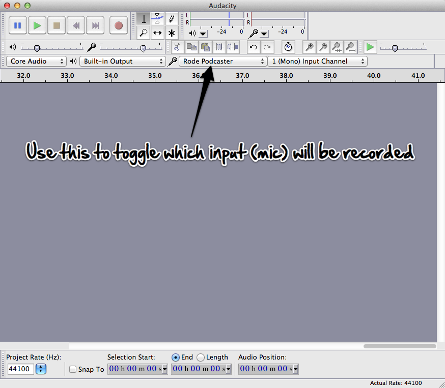
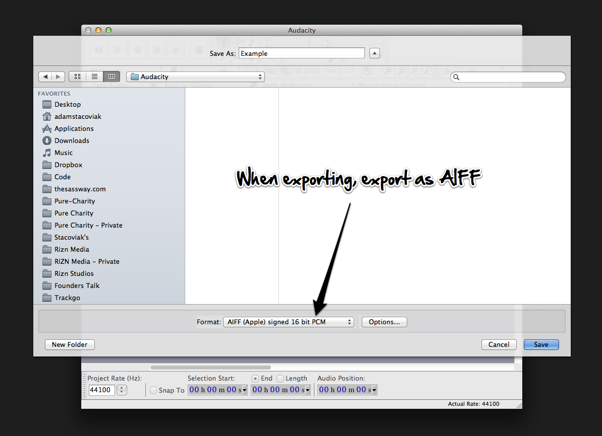

# Podcast guest audio setup

First of all, thank you for joining us on the show!

We do take our audio seriously, so we’ve prepared these instructions to help you get setup and sound your best on the show. Please take 5 minutes and read through and follow the instructions.

If you need help? Contact [Adam](https://twitter.com/adamstac) or [Jerod](https://twitter.com/jerodsanto).

## Todo list for getting setup

Make sure you have the following and also can record your side of the audio.

- Reliable internet connection. We prefer wired, but if you know for sure that your wireless connection is solid we’ll trust you.
- Skype account. Add ‘adamstac’ as a contact.
- USB headset, or a decent microphone.
- Headphones! Yes, headphones are required. They CAN NOT be iPhone headphones, they cause audio bleed.
- Quiet place to record
- No mobile phones (they interfere with the audio)
- Install Audacity (see below) or if you have something installed you’re comfortable recording .aiff audio files in mono.
- Do a 2 minute test recording and share it with Adam
- Be ready on Skype approximately 5-10 minutes before to showtime.
- Adam will contact you on Skype before the show starts. Please do not call him, he’ll be preping to start the show.
- Relax. Have fun. Bring your opinions.

## Setup Audacity

Download and install [Audacity](http://audacity.sourceforge.net/download/). Once you’ve installed Audacity, you’ll need to open it and set it up to record your microphone.



## Export to .aiff

Once the show is over and the recording is complete, save your Audacity project and then export an ```.aiff``` file to share with Adam.



## Share the file

After you’ve exported the file, email the file to Adam via Dropbox or any other private URL.

And, you’re done. Thanks for joining us on The Changelog!